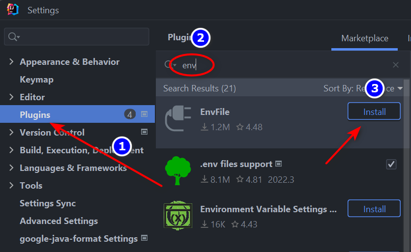
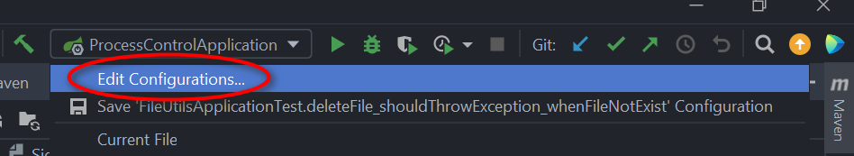
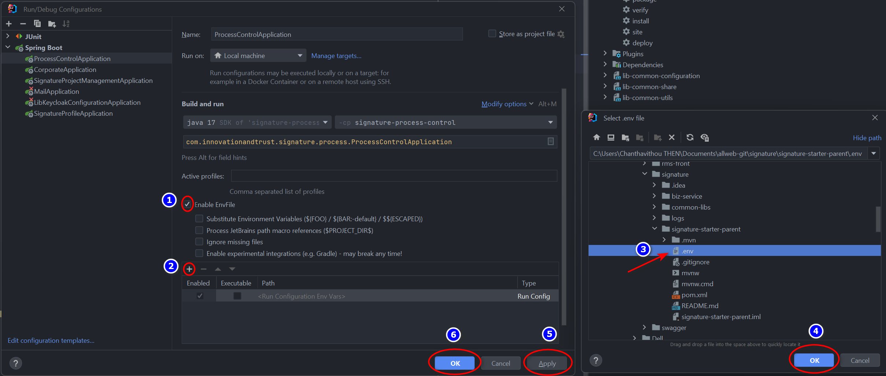

# How to configure a project structure of Signature in development
***
1. Create directory name __*signature*__
2. Clone project *signature-starter-parent* into __*signature*__ directory
3. Create directory __*biz-services*__
4. Clone *signature-profile-management* into directory __biz-services__
5. Clone *signature-corporate-profile* into directory __biz-services__
6. Clone *signature-process-control* into directory __biz-services__
7. Clone *signature-project-management* into directory __biz-services__
8. Clone *signature-notification* into directory __biz-services__
9. Clone *signature-identity-verification* into directory __biz-services__
10. Create a directory named __*common-libs*__
11. Clone *common-lib-configuration* into directory __*common-libs*__
12. Clone *common-lib-share* into directory __*common-libs*__
13. Clone *common-lib-utils* into directory __*common-libs*__

# Project structure
***
```agsl
signature
|-- signature-starter-parent
|-- biz-services
    |-- signature-profile-management
    |-- signature-corporate-profile
    |-- signature-process-control
    |-- signature-project-management
    |-- signature-sftp
    |-- signature-notification
    |-- signature-identity-verification
|-- common-libs
    |-- lib-common-configuration
    |-- lib-common-share
    |-- lib-common-utils
```

# Installation

***

## To use microservice, you need to do in the following step:

- Add new microservice module to parent modules in ``pom.xml``:

> ```xml
>   <modules>
>        <module>microservice path</module>
>    </modules>
>```

# IDE (Intellij)
***
To run the signature microservices with the IDE, you can follow the steps below:

- Clone all projects of signature microservices following the above structure
- Open directory _*signature*_ as a project from *Intellij IDE*

> Go to:  File > Open > choose the directory > click OK

- Add parent ``relativePath`` to your microservice:

> ```xml
>  <relativePath>../../signature-starter-parent</relativePath>
> ```

* Env configuration in the following example step:

Step one:



***

Step two:



***

Step three:



* Click on ``Maven`` menu of the left sidebar
    * Click on ``Reload All Maven Projects`` to download the dependency.
    * Select ``clean``, ``install`` and ``package`` and click on ``Run`` button