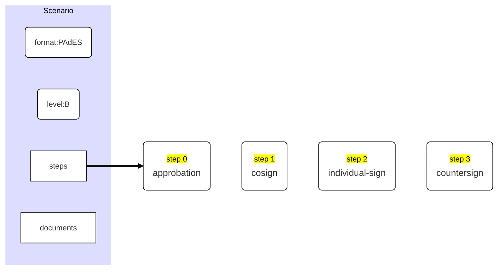

# API-NG: scenarios' automaton


## Defining a Scenario

In API-NG first version, defining a workflow of documents' approbations and signature is done by chaining scenarios one after another.

Each scenario contains a list of documents you want to approve or sign and how you want to sign them (format and level of signature) and more importantly a list of steps you want to go through to sign those documents.

Scenario content:

| Field       | Type                        | Description                                                  |
| ----------- | --------------------------- | ------------------------------------------------------------ |
| `documents` | `Array` of strings          | List of documents' URL involved in the scenario.             |
| `format`    | `string`                    | Global signature format (CAdES, XAdES or PAdES).             |
| `level`     | `string`                    | Level signature format (B, T, LT or LTA).                    |
| `steps`     | Array of `StepNode` objects | List of scenario steps you must to achieve to complete the scenario. |

On this first version of the API-NG each `StepNode` object is a simple structure containing:

| Field           | Type                          | Description                                                  |
| --------------- | ----------------------------- | ------------------------------------------------------------ |
| `process`       | tag as string                 | The kind of approbation or signature we want for this scenario's step (see below) |
| `cardinality`   | `number` or '`all`' or '`on`' | The number of signatures or approbation we need for this scenario's step |
| `signatureType` | `number`                      | If this is a signature and not an approbation, the type of signature (meaning enveloped, enveloping or detached signature). <br />The type you put in there should be relevant to the format of the signature you previously choose on your scenario's definition. <br />Mandatory only for signature process kind. |
| `steps`         | `Array` of strings            | List of URLs of actors (persons) involved in this scenario's step. |

A `process`  can be:

| Process kind         | Available Tags                                               | Description                                                  |
| -------------------- | ------------------------------------------------------------ | ------------------------------------------------------------ |
| Approbation          | <big>approbation</big> or any other specific approbation tag | The step is an approbation step which means no document's signature is involved. |
| Cosignature          | <big>cosign</big>                                            | This is a co-signature step which means that 1, a subset or all the actors involved in this step must sign the same document and there is no specific order for the signatures to take place. Anyone can sign the document before or after one another. |
| Counter signature    | <big>countersign</big>                                       | This is a counter-signature step which means that  all the actors involved in this step must sign the same document one after another. |
| Ordered Cosignature  | <big>ordered-cosign</big>                                    | This is a co-signature step where every actor involved in the step must sign the same document one after another. |
| Individual signature | <big>individual-sign</big>                                   | One, a subset or all specified actors in this step must sign the document individually, which means that each actor will sign its own copy of any document. |

So, basically, a scenario can be fully described by a simple JSON schema like this one:

```json
{
  "format": "PAdES",
  "level": "B",
  "documents": [
    "/session/25/document/300", 
    "/session/25/document/500"
  ],
  "steps": [
    {
      "process": "approbation",
      "cardinality": "one",
      "steps":[
      	"/session/25/actor/100", 
    		"/session/25/actor/20", 
    		"/session/25/actor/35"
      ]
    },
    {
      "process": "cosign",
      "cardinality": 2,
      "signatureType": "envelopped",
      "steps": [
      	"/session/25/actor/109", 
    		"/session/25/actor/203", 
    		"/session/25/actor/42",        
      	"/session/25/actor/97", 
    		"/session/25/actor/208", 
    		"/session/25/actor/125"
      ]
    },
    {
      "process": "individual-sign",
      "cardinality": "all",
      "signatureType": "envelopped",      
      "steps": [
      	"/session/25/actor/87", 
    		"/session/25/actor/49",         
      ]
    }, 
    {
      "process": "countersign",
      "signatureType": "envelopped",
      "steps": [
      	"/session/25/actor/17", 
    		"/session/25/actor/139",                 
      ]
    }
  ]
}
```

In plain English, you can describe this example of scenario as 3 phases :

1. One of the any 3 persons (20, 35 or 100) must approve the 2 documents.
2. Two of the 6 persons (42, 97, 109, 125, 203 and 208) must sign the 2 documents in any order.
3. Two persons (49 and 87) must sign their own copies of both documents.
4. The last 2 persons (17 and 139) will sign 4 documents because they need to sign both copies of both documents.

Once concluded, this scenario will result in 4 signed documents which are 2 copies are the 2 original documents. 

Each document would have been approved and sign by people in phases 1 and 2 and each copy is signed par one of the two persons during phase 3 and then all documents are signed by last 2 actors.

<hr />

## Behind the scene lies an automaton

Obviously, the API-NG workflow manager does transform any scenario and its included steps in a more computer-oriented structure. This structure, represented by an interface called `Automat` is created by a function called `validateScenarioSteps()` which takes a list of `StepNode` objects, checks the validity of the defined steps and turn them into an `Automat` strucuture.

As a matter of facts, an automaton is defined as a series of autormat nodes (`AutomatNode` structure) which are a sort of internal step defined to monitor the workflow inside a scenario and an `index` indicating which node is the current node. 

Definition of an `Automat` structure:

| Field   | Type                           | Description                                                  |
| ------- | ------------------------------ | ------------------------------------------------------------ |
| `nodes` | Array of `AutomatNode` objects | Automaton's linear workflow steps                            |
| `index` | `number`                       | Current node of the automaton indicating the stage we are on the whole scenario workflow |

Even if the automaton nodes are created from scenario steps, they are fondamentally different and serve different purposes. 

Definition of an `AutomatNode` :

| Field               | Type                         | Description                                                  |
| ------------------- | ---------------------------- | ------------------------------------------------------------ |
| `tag`               | `string`                     | approval or signing process for the node                     |
| `aids`              | `Array` of numbers           | list of actors identifiers who can sign or approve at this stage |
| `dids`              | `Array` of numbers           | list of documents identifiers which should be signed or approved |
| `concernedActors`   | `number`                     | number of actors which should sign or approve the documents  |
| `roleType`          | `enum`                       | Approval, Signature or Expedition node                       |
| `stepIndex`         | `number`                     | The scenario's step's index from which this node is created  |
| `done_aids`         | `Array` of numbers           | identifiers of actors who have fulfilled their duties        |
| `done_dids`         | `Array` of numbers           | identifiers of documents which have been fully signed        |
| `working_documents` | `Array` of arrays of numbers | per remaining document a list of actor identifiers who have already signed the document |

### Creating an Automat structure from a scenario

The `validateScenarioSteps()` function creates a list of `AutomatNode` from a list of scenario `steps`. 

For each scenario `step`:

- if `step.cardinality` is not set in the request, it sets it to all if the `step.process` tag is <big>cosign</big>,

- it verifies that `step.cardinality` is set to all if the `step.process` tag is <big>countersign</big> or <big>ordered-cosgn</big>,

- for all approbation process, it verifies that any of the involved documents was not previously signed by any actor or already approved by one of the scenario's involved actor,

- for all signature process, it verifies that the involved actors have not already previously signed any of the involved documents,

- and depending on `step.process` tag value:

  | Kind of tag                                                  | Automa's node generation                                     |
  | ------------------------------------------------------------ | ------------------------------------------------------------ |
  | Approbation or <big>cosign</big> or <br /><big>individual-sign</big> | creates a unique automaton's node with all the involved actors and documents <br />where `node.concernedActors` = `step.cardinality`.<br />Created node.stepIndex = scenario |
  | <big>countersign</big> or<br /><big>ordered-cosign</big>     | creates as many automaton nodes as the value of `step.cardinality`. <br />Each created `AutomatNode` as only one actor (the actor in the i-th position <br />in the scenario's step definition) indicating that this actor must sign all involved documents. |

- Each created automaton's node keeps a reference to the scenario's step it comes from with the `node.stepIndex` reference (in <big>countersign</big> or <big>ordered-cosign</big> steps, all created nodes share the same `node.stepIndex`).

So, if we take our last example, our scenario has the following structure :



It will be rendered in this automaton structure:

```mermaid

%%{init: {'theme': 'base', "flowchart" : { "curve" : "basis" }, 'themeVariables': { 'fontSize': '12px', 'primaryColor':'#FFFFFF', 'primaryBorderColor': '#000000', 'clusterBorder':'#FFFFFF', 'clusterBkg': '#DDDDFF'}}}%%

graph LR
IDX("index:0")
nodes ===>A("<mark style='line-height:25px'>node 0</mark>\n[stepIndex:0]\n<big>approbation</big>\n(1 actor of 3 actors)")
A --- B("<mark style='line-height:25px'>node 1</mark>\n[stepIndex:1]\n<big>cosign</big>\n(2 actors of 6 actors")
B --- C("<mark style='line-height:25px'>node 2</mark>\n[stepIndex:2]\n<big>individual-sign</big>\n(actors 87 and 49)")
C --- D("<mark style='line-height:25px'>node 3</mark>\n[stepIndex:3]\n<big>countersign</big>\n(actor 17)")
D --- E("<mark style='line-height:25px'>node 4</mark>\n[stepIndex:3]\n<big>countersign</big>\n(actor 139)")
subgraph Automat
  IDX
  nodes
end
subgraph originated from <mark>step 3</mark>
  D
  E
end
```

As you can see, in our example, 3 scenario's steps generate 5 automaton nodes :

- `AutomatNode[0]` derives from `StepNode[0]` (`stepIndex:0)`,
- `AutomatNode[1]` derives from `StepNode[1]` (`stepIndex:1`),
- `AutomatNode[2]` derives from `StepNode[2]` (`stepIndex:2`),
- `AutomatNode[3]` derives from `StepNode[3]` (`stepIndex:3`),
- `AutomatNode[4]` derives from `StepNode[3]` (`stepIndex:3`).

which will be represented as the JavaScript equivalent structure, including generated `done_aids`, `done_dids` and `working_documents` fields :

```javascript
createdAutomat = {
  index:0,	// the automaton is at its begining state
  nodes: [
		{ 
      // node[0]
      aids:[20, 35, 100],					// actors who can approve the documents
      dids:[300, 500], 						// documents to approve
      concernedActors:1,					// number of actors who must approve
      roleType:RoleType.Approval,
      stepIndex:0,								// original scenario's step index
      tag:"approval",
      done_aids:[],
  	  done_dids:[],
      working_documents = [ [], [] ]
    },
    {
      // node[1]
      aids:[42, 97, 109, 125, 203, 208],	// actors who can sign the documents
      dids:[300, 500], 									  // documents to sign
      concernedActors:2,									// number of actors who must sign
      roleType:RoleType.Signature,
      stepIndex:1,												// original scenario's step index
      tag:"cosign",
      done_aids:[],
  	  done_dids:[],
      working_documents = [ [], [] ]
    },
    {
      // node[2]      
      aids:[49, 87],								// actors who can sign the documents
      dids:[300, 500], 							// documents to sign
      concernedActors:2,						// number of actors who must sign (all actors must sign here)
      roleType:RoleType.Signature,
      stepIndex:2,									// original scenario's step index
      tag:"individual-sign",      
      done_aids:[],
  	  done_dids:[],
      working_documents = [ [], [] ]
    },
    {
      // node[3]                  
      aids:[17],										// actor who can sign the documents
      dids:[300, 500], 							// documents to sign
      concernedActors:1,						// number of actors who must sign
      roleType:RoleType.Signature,
      stepIndex:3,									// original scenario's step index
      tag:"countersign",            
      done_aids:[],
  	  done_dids:[],
      working_documents = [ [], [] ]
    },
    {
      // node[4]            
      aids:[139],										// actor who can sign the documents
      dids:[300, 500], 							// documents to sign
      concernedActors:1,						// number of actors who must sign
      roleType:RoleType.Signature,
      stepIndex:3,									// original scenario's step index
      tag:"countersign",            
      done_aids:[],
  	  done_dids:[],
      working_documents = [ [], [] ]
    }
  ]
}
```


### Managing the automaton state

The automaton state is composed is evolving each time someone approve or sign any related document. 

At start (before any approbation or signature) the automaton indicates that its current node index is 0 and that nothing was done in the current node.

How do we know that « something » was done in an automaton's node ? For that, we use the following fields of the nodes' structure :

| field               | Description                                                  |
| ------------------- | ------------------------------------------------------------ |
| `aids`              | this array contains a list of actors' identifiers who still could take action on the remaining documents to be approved or signed |
| `dids`              | this array contains a list of documents' identifiers which still need to be approved or signed |
| `done_aids`         | this array contains a list of actors' identifiers who have fulfilled their duty and are not to be used for more action in the current node |
| `done_dids`         | this array contains a list of documents' identifiers which are fully approved or signed and are not to be used for more action in the current node |
| `working_documents` | this array contains an array of actors' array who have already approved or signed the corresponding documents. `node.working_documents` array has **always** same length of `node.dids`. |

So, at start, all nodes hold empty `done_aids` and `done_dids` arrays and a `working_documents` dictionary holding, for each document, an empty array of actors' identifiers (see the example above).

So to be at start, an automaton must have an `index` of `0` and the first node of the automaton's `nodes` array must not have any  work in progress, which means to have only empty lists of actors' identifiers in `working_documents` array.

To know if an automaton is at start, you can use the function:

```typescript
function isAutomatAtStart(self: Automat) : boolean
```

At the contrary, to be at end, an automaton must have an `index` to be superior or equal to the automaton's `nodes` array length or pointing to the last node of the its `nodes` array and this last node (which is also the current node) must not have any documents left to be approved or signed (`node.dids.length == 0`).

To know if an automaton has come to its end, you can use the function:

```typescript
function isAutomatAtEnd(self: Automat) : boolean
```

And if you want to know the current node of any automaton, you use the function:

```typescript
function automatCurrentNode(self:Automat) : AutomatNode | null
```

Imagine now that we want to proceed with our automaton's example and explain the evolution at the Automat's structure when we go though the approbation and signature workflow.

#### Deep in the first approbation step

For the first approval step, say that actor 35 approves boths 300 and 500 documents. After this approbation, the first node of our automaton's structure will look like :

```typescript
createdAutomat = {
  index:1,												// the automaton is not any more at its beginning index
  																// because first node action is completly done
  nodes: [
		{
      tag:"approval",      
      roleType:RoleType.Approval,
      stepIndex:0,								// original scenario's step index
      concernedActors:1,					// number of actors who must approve the documents
      
      aids:[20, 100],					    // actors who could possibly approve the documents 
      														// (but there are no more documents to be approved)
      
      dids:[], 										// no more documents to be approved

      done_aids:[35],							// only one actor has done its duty but other
  																// actors action is not required since
																	// all documents have been approved once (concernedActors:1)

  	  done_dids:[300, 500],				// all documents are done 
      
      working_documents = []			// no working documents left
    },

		... 													// last nodes
	]
}
```

Imagine now that our actor 35 only approved document 500 and then our 20 actor will approve document 300. 

On the first approval action, our automaton will need to stay on the first index because this first step is not done:

```typescript
createdAutomat = {
  index:0,												// the automaton is still to starting index 0
  nodes: [
		{
      tag:"approval",      
      roleType:RoleType.Approval,
      stepIndex:0,								// original scenario's step index
      concernedActors:1,					// number of actors who must approve the documents
      
      aids:[20, 35, 100],					// actors who could possibly approve the remaining documents 
      														// (our 35 actor is still here)
      
      dids:[300], 								// still one document to be approved

      done_aids:[],							  // no actor is disqualified for the next round on this step

  	  done_dids:[500],						// one document is node 
      
      working_documents = [[]]		// there is one empty list of actors corresponding to the
  																// 300 document which is still virgin of any action
    },
		...														// last nodes
	]
}
```

On the second one, all documents are approved and we will go to automaton's index 1:

```typescript
createdAutomat = {
  index:1,												// the automaton indicates now that node 0 is fulfilled
  nodes: [
		{
      tag:"approval",      
      roleType:RoleType.Approval,
      stepIndex:0,								// original scenario's step index
      concernedActors:1,					// number of actors who must approve the documents
      
      aids:[20, 35, 100],					// actors who could possibly approve the remaining documents 
      														// (all actors are still here since 20 and 35 only approved 1 doc each)
      
      dids:[], 										// all documents are approved

      done_aids:[],							  // no actor is disqualified (20 and 35 approved only 1 doc)

  	  done_dids:[300, 500],				// all documents are done 
      
      working_documents = []		  // there is no more documents in process of approval
    },
		...														// last nodes
	]
}
```


As you can see, there's a minor difference in our `nodes[0]` content after the approval of 2 documents by the same actor or each document approved by a different one. In the first case, the actor is removed from the `aids[]` array and added to `done_aids[]` one and in the second case, both these array stayed as they were at the automaton's creation.

If we now imagine that on a first action actor 35 approves document 500 and on a second one approves document 300 wil would have two different automaton evolutions.

The first one would be the same as the previous one, since actor 35 also approved document 500, and the second one will give us the following result: 

```typescript
createdAutomat = {
  index:1,												// the automaton indicates now that node 0 is fulfilled
  nodes: [
		{
      tag:"approval",      
      roleType:RoleType.Approval,
      stepIndex:0,								// original scenario's step index
      concernedActors:1,					// number of actors who must approve the documents
      
      aids:[20, 100],					     // actors who could possibly approve the remaining documents 
      														// (35 is not there any more since it approved both documents)
      
      dids:[], 										// all documents are approved

      done_aids:[35],							// 35 is disqualified

  	  done_dids:[300, 500],				// all documents are done 
      
      working_documents = []		  // there is no more documents in process of approval
    },
		...														// last nodes
	]
}
```

What we see here is that for actor 35, approving both documents at once or one after another gives the same automaton's state at the end, which is exactly what we want. 

#### Advancing in our scenario : cosigning the documents

In our scenario, our second node (`node[1]`) is anout cosigning the same documents and 6 new actors can do it and 2 of them must do it.

Since 2 actors needs to sign both documents. Our node will take at least 2 actions and can take up to 4 actions if each action is taken by one different actor.

Simplest actions schema first: actor 109 sign both documents and then actor 203 also sign both documents.

First action will result in that `Automat` structure still working on node 1:

```typescript
{
  index:1,																// the automaton stays on node 1
  nodes:[
    ...,																	// node 0
    {
      // node 1
      tag:"cosign",      
      roleType:RoleType.Signature,
      stepIndex:1,												
      concernedActors:2,									// number of actors who must sign      
    	aids:[42, 97, 125, 203, 208],				// actors who can sign the documents. 109 was removed
      dids:[300, 500], 									  // all documents still need to be signed by at least 1 actor

      done_aids:[109],										// actor 109 has fulfilled its duty
  	  done_dids:[],												// no document is completly signed
      working_documents = [[109], [109]]  // both documents have been signed by actor 109   
    },
    ...																		// last nodes
  ]
}
```

Second action will result will be:

```typescript
{
  index:2,																// the automaton is now on node 2 because node 1 is completed
  nodes:[
    ...,																	// node 0
    {
      tag:"cosign",      
      roleType:RoleType.Signature,
      stepIndex:1,												
      concernedActors:2,									// number of actors who must sign      
    	aids:[42, 97, 125, 208],						// actors who could sign the documents. 109 & 203 were removed.
    																			// (but there are no more document to be signed)
    
      dids:[], 									  				// all documents are signed

      done_aids:[109, 203],								// actor 109 and 203 have fulfilled their duty
  	  done_dids:[300, 500],								// all documents are completly signed
      working_documents = []  						// no more working documents   
    },
    ...																		// last nodes
  ]
}
```

Imagine now that the signing scenario would be actor 97 sign the first document (document 300) then actor 125 sign both and actor 97 will sign the second one:

Our automaton will register those 3 actions:

```typescript
{
  index:1,																// the automaton stays on node 1
  nodes:[
    ...,																	// node 0
    {
      tag:"cosign",      
      roleType:RoleType.Signature,
      stepIndex:1,												
      concernedActors:2,									// number of actors who must sign      
    	aids:[42, 97, 109, 125, 203, 208],	// all actors can sign the documents
    																			// but since 97 is register has a document 300 signer
    																			// he will not be abble to resign it
    
      dids:[300, 500], 									  // all documents still need to be signed by at least 1 actor

      done_aids:[],												// no actor has fulfilled its duty
  	  done_dids:[],												// no document is completly signed
      working_documents = [[97], [] ]  	  // document 300 was signed by actor 97   
    },
    ...																		// last nodes
  ]
}
```

```typescript
{
  index:1,																// the automaton still stays on node 1
  nodes:[
    ...,																	// node 0
    {
      tag:"cosign",      
      roleType:RoleType.Signature,
      stepIndex:1,												
      concernedActors:2,									// number of actors who must sign      
    	aids:[42, 97, 109, 203, 208],				// 125 has signed both documents
    
      dids:[500], 									  		// only document 500 still needs to be signed 


      done_aids:[125],										// has fulfilled its duty
  	  done_dids:[300],										// document 300 is fully signed
        																	// (both by actors 97 and 125)      
      working_documents = [[125]]  	  	  // document 500 was signed by actor 125   
    },
    ...																		// last nodes
  ]
}
```

```typescript
{
  index:2,																// automaton is now on node 2, since node 1 is done
  nodes:[
    ...,																  // node 0
    {
      tag:"cosign",      
      roleType:RoleType.Signature,
      stepIndex:1,												
      concernedActors:2,									// number of actors who must sign      
    	aids:[42, 109, 203, 208],					  // 97 and 125 have signed both documents
      dids:[], 									  				// no more documents to be signed 
      done_aids:[125, 97],								// both 97 and 125 have fulfilled their duty
  	  done_dids:[],												// all documents fully signed
      working_documents = []  						// no more working documents   
    },
    ...																		// last nodes
  ]
}
```

We now will imagine that each document will be signed by different actors:

1. actor 208 sign document 500, 
2. actor 125 sign document 300, 
3. actor 97 sign document 300, 
4. actor 109 sign document 500). 

This will result in a those automaton evolutions: 

```typescript
{
  index:1,																// the automaton stays on node 1
  nodes:[
    ...,																	// node 0
    {
      tag:"cosign",      
      roleType:RoleType.Signature,
      stepIndex:1,												
      concernedActors:2,									// number of actors who must sign      
    	aids:[42, 97, 109, 125, 203, 208],	// all actors can sign the documents
      dids:[300, 500], 									  // all documents still need to be signed by at least 1 actor
      done_aids:[],												// no actor has fulfilled its duty
  	  done_dids:[],												// no document is completly signed
      working_documents = [[], [208] ]  	// document 500 was signed by actor 208   
    },
    ...																		// last nodes
  ]
}
```

```typescript
{
  index:1,																// the automaton stays on node 1
  nodes:[
    ...,																	// node 0
    {
      tag:"cosign",      
      roleType:RoleType.Signature,
      stepIndex:1,												
      concernedActors:2,									// number of actors who must sign      
    	aids:[42, 97, 109, 125, 203, 208],	// all actors can sign the documents
      dids:[300, 500], 									  // all documents still need to be signed by at least 1 actor
      done_aids:[],												// no actor has fulfilled its duty
  	  done_dids:[],												// no document is completly signed
      working_documents = [[125], [208] ] // document 300 signed by 125 and 500 signed by 208   
    },
    ...																		// last nodes
  ]
}
```

```typescript
{
  index:1,																// the automaton stays on node 1
  nodes:[
    ...,																	// node 0
    {
      tag:"cosign",      
      roleType:RoleType.Signature,
      stepIndex:1,												
      concernedActors:2,									// number of actors who must sign      
    	aids:[42, 97, 109, 125, 203, 208],	// all actors can sign the documents
      dids:[500], 									  		// only document 500 still need to be signed by 1 actor
      done_aids:[],												// no actor has fulfilled its duty
  	  done_dids:[300],										// document 300 is completly signed
      working_documents = [[208] ] 				// document 500 signed by 208 still on for signinig   
    },
    ...																		// last nodes
  ]
}
```

```typescript
{
  index:2,																// the automaton is on the new node 2
  nodes:[
    ...,																	// node 0
    {
      tag:"cosign",      
      roleType:RoleType.Signature,
      stepIndex:1,												
      concernedActors:2,									// number of actors who must sign      
    	aids:[42, 97, 109, 125, 203, 208],	// all actors couuld sign the documents
    																			// (but there's no more any documents to be signed)
    
      dids:[], 									  				// all documents are signed
      done_aids:[],												// no actor has fulfilled its duty
  	  done_dids:[300, 500],								// all documents are signed
      working_documents = [] 							// no document in any signing process   
    },
    ...																		// last nodes
  ]
}
```

#### Ending the scenario

We could continue to advance in our scope be we think you get the idea of how the approbation and signature workflow advances.

In the steps to come we will need to:

1. On `node[2]` we will need to make an individual sign by actor 49 and actor 87 on both doculents. It can take 2 to 4 actions to do so because, like the previous `node[1]` cosigning phase, we can have 6 patterns for actions which could take place:

   - one actor signing both documents and then the other one signing both documents
   - one actor signing both documents and then the other one signing one document then the other one
   - one actor signing one document, the second one signing both documents and the first one signing the other document
   - one actor signing one document, then signing the other one, then the other actor signing both documents
   - one actor signing one document, then signing the other one, then the other one signing one document then the other one
   - one actor signing one document, the other actor signing one, then the first actor signing the other and then the other actor signing its last one.

   In every pattern, the result will be that all actors will be consumed and all documents will be signed, which could give the folowing result:

   ```typescript
   {
     index:3,																// the automaton is on the new node 3
     nodes:[
       ...,																	// first nodes
       {
         tag:"individual-sign",      
         roleType:RoleType.Signature,
         stepIndex:2,												
         concernedActors:2,									      
       	aids:[],														// all actors have done their duties
         dids:[], 									  				// all documents are signed
         done_aids:[49, 87],									// all actors have done their duties
     	  done_dids:[300, 500],								// all documents are signed
         working_documents = [] 							// no document in any signing process   
       },
       ...																		// last nodes
     ]
   }
   ```

   In fact, the only change in the `node[2]` structure after its completion is the order of `done_aids` and `done_dids` arrays. You can have:

   ```typescript
   	done_aids:[49, 87] OR done_aids[87,49]
   AND
   	done_dids:[300, 500] OR done_dids[500,300]
   ```

   depending on which signatures' pattern the 2 actors did follow.

2. On `node[3]` actor 17 will sign both documents. The structure result of the this node could be:

   ```typescript
   {
     index:5,																// the automaton is on the new node 5
     nodes:[
       ...,																	// first nodes
       {
         tag:"countersign",      
         roleType:RoleType.Signature,
         stepIndex:3,												
         concernedActors:1,									      
       	aids:[],														// actor 17 has done its duty
         dids:[], 									  				// all documents are signed
         done_aids:[17],											// 17 has signed both documents
     	  done_dids:[300, 500],								// all documents are signed
         working_documents = [] 							// no document in any signing process   
       },
       ...																		// last nodes
     ]
   }
   
   ```

3. On `node[4]` actor 139 will sign both documents. The structure result of the this node and the whole scenario could be:

   ```typescript
   {
     index:6,																// the automaton is at its end (there's no node 6)
     nodes:[
       ...,																	// first nodes
       {
         // this is the last node of our automaton
         tag:"countersign",      
         roleType:RoleType.Signature,
         stepIndex:3,												
         concernedActors:1,									      
       	aids:[],														// actor 139 has done its duty
         dids:[], 									  				// all documents are signed
         done_aids:[139],										// 139 has signed both documents
     	  done_dids:[300, 500],								// all documents are signed
         working_documents = [] 							// no document in any signing process   
       }
     ]
   }
   ```

From our automaton's point of view our scenario's workflow is now concluded. 

<hr />

## The automaton roles

As you can see, our automaton evolves only on document's action level. 

The action itself does not realy depend on which process' tag we are (the tag is only checked to verify if the action is conform to the current atuamt's node definition) 

It totally ignore any kind of concrete action is done to actually approve or sign the documents : tt only checks and register the actor's action on those documents has an evolution of the automaton's state.

All those checks, evolutions and state registering are done in the function :

```typescript
function automatCopyWithActorAction(A:Automat, actor:LocalID, tag:string, docs:DocumentIDs) : Automat
// A: 	  source automaton
// actor: the identifier of the actor which will make an action
// tag: 	the action tag. Must be the same as the current valid node tag
// docs:	an array of documents' identifiers indicating on which document the action is made
// the function returns a new Automat structure 
```

The purpose of this function is to produce a copy of any `Automat` structure upon an actor's action on documents. If anything does not match (unknown actor in the current node, unknown document, already signed document, already dismissed actor, wrong tag…) this function will throw.

The returned `Automat` structure takes all change resulting from the passed action into account.

`automatCopyWithActorAction()` function is called at the end of `initiateSigningOrApprobation()` function which is called at the begining of each approbation or signature procedure. 

The rôle of `initiateSigningOrApprobation()` is to fetch the scenario's and its current automaton from the database and make a copy of this automaton taking into account the action, the actor doing it and the target documents.

 To conclude, the automaton roles are:

- to check the conformity of any action,
- to make advance the state of the workflow in a righthous way,
- since the automaton evolution (i.e. a new copy of an evolved `Automat` structure) is processed at the begining of any approbation or signature procedures, it prepares any « physical » needed  actions on the document files concerned by the current action

You may want to have a look on **sessionSignature.md** document (or its PDF version) to have more detail on effective signing documents processes.
