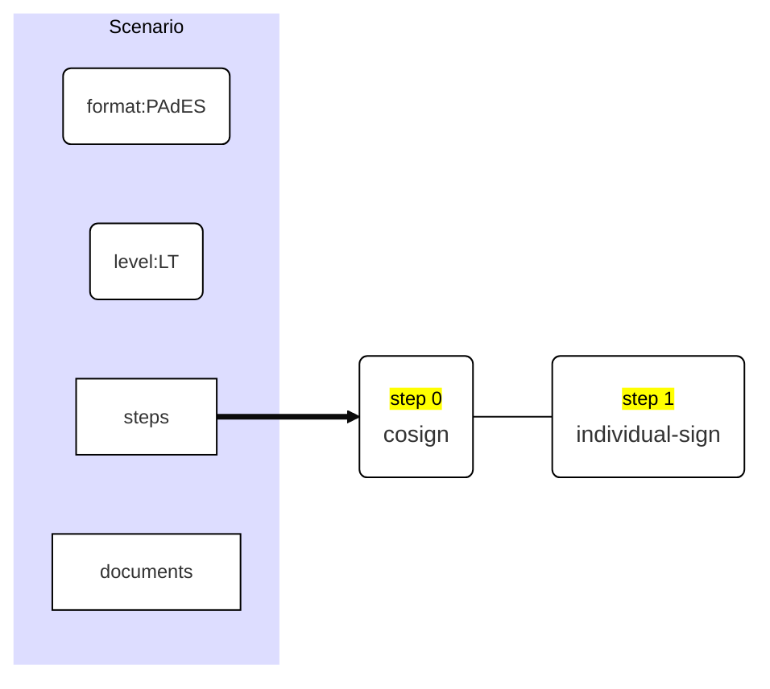
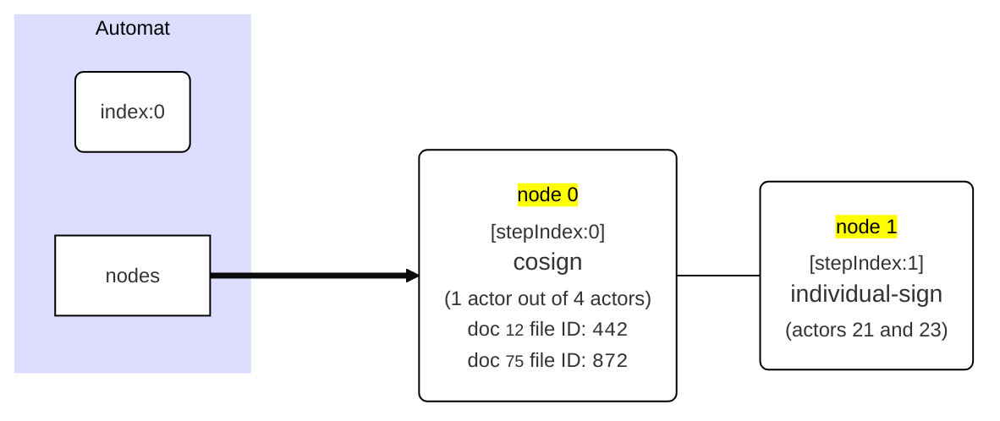
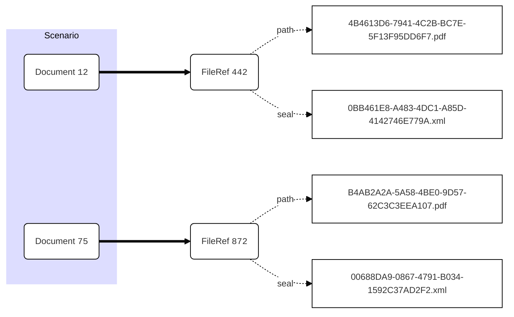
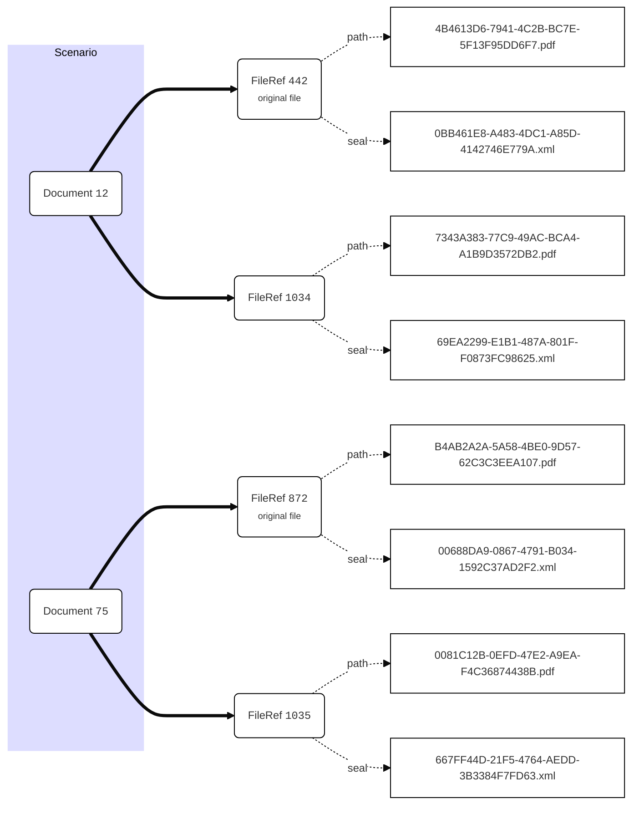
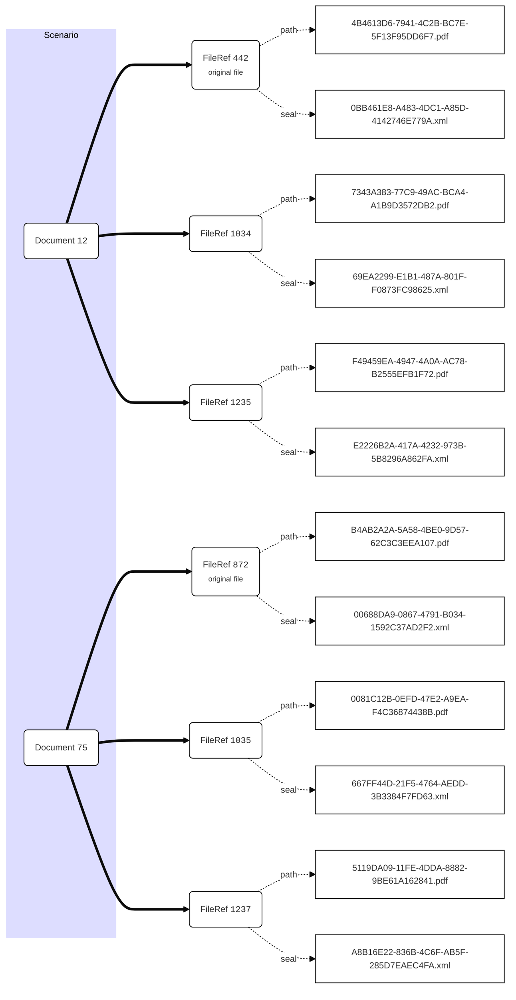

# API-NG: Signing mechanisms

Before reading about signing mechanism, we invite you to have a look on the document automat.md (or automat.pdf) which describe how you define a scenario, the internal automaton which derives from this scenario definition and how the state of this automaton evolves during approbation and signature procedures

Sining documents is more complicated than approving them. It's done using the the function `signDocuments()` defined in the `sessionSignature.ts` file:

```typescript
async function signDocuments(
	auth:APIAuth,
  sessionPublicID:number, 
  requestID:number|string, 
  body:SessionDirectSignDocumentsBody,
  certificateURL?:Nullable<string>) 
: Promise<SigningResource>
```

There's two ways to sign documents : with or without an on-the-fly generated certificate. 

If you provide a significant `certificateURL`parameter, the certifcate resource of a previously generated certificate will be used to sign electronically the files associated to the documents.

If you don't provide any valide `certificateURL`, the signature system will reach for a long term certificate associated to the authenticated 

## Starting signing process

### Getting the documents we want to sign

Since we accept a body which accepts to define documents to be signed as an array of URLs or nodes containing the URL itself and a bunch of visual parameters (`SessionSignDocumentNode` structure) for the signatures, we need first to analyse the body in order to put it in a form the function  `checkSigningAndApprobation()` can understand and extract the optional visual parameters for later.

This is done at the begining of the function by constructing a `localDocuments` array containing `LocalDocumentNode` structures defined as such:

| Field        | Type                                | Description                                                  |
| ------------ | ----------------------------------- | ------------------------------------------------------------ |
| `url`        | `string`                            | the document's URL                                           |
| `did`        | `LocalID` (`number`)                | the document's identifier                                    |
| `parameters` | `SigningVisualParameters` interface | parameters indicating how to visually insert a signature in the signed PDF file |

This operation, consist of a normalization of the information we have about the documents we want to sign: 

```typescript
let localDocuments:LocalDocumentNode[] = [] ;
for (let element of body.documents)	{
  let node:LocalDocumentNode ;
  if ($isstring(element)) {
    node = {
      url: <string>element,
      did:$url2lid(<string>element)
    }
  }
  else {
    const u = (<SessionSignDocumentNode>element)['document-url'] ;
    node = {
      url:u,
      did:$url2lid(u),
      parameters:(<SessionSignDocumentNode>element)['visual-parameters']
    }
  }
  if (node.did === 0) {
    throw new BadRequestError('Bad document id to be signed') ;
  }
  localDocuments.push(node) ;
}

```

### Preparing the automaton, the certificates and our signing requests

From this array and other infos, we check our body and generate our next scenario's automaton with the a call to `initiateSigningOrApprobation()`function :

```typescript
const checkedBody = {
  actor:body.actor,
  documents:localDocuments.map(node => node.url),
  'manifest-data':body['manifest-data'],
  otp:$length(body.otp)?<string>(body.otp):'',
  tag:body.tag
}

let context = await initiateSigningOrApprobation(
	api, 
	auth, 
	trx, 
	sessionPublicID, 
	checkedBody, 
	'sign', 
	api.conf.signatureManifestData
) ; // no default tag specified here
```

If you want a precise information how the scenario's automaton evolves upon an actor's action, please read the automat.ts (or automat.pdf) document. 

Then, if needed (e.g. if we use an on-the-fly generated certificate), we fetch the certificate we will use for signing the documents, the certificate's associated token and verify that the actor who is registered in this token is the same as the one signing:

```typescript
certificate = await getSessionCertificate(
    auth,
    sessionPublicID,
    $url2gid(certificateURL),
    {trx:trx}
) ; 

// loading the token and the actor associated to the certificate
token = await certificate.$rq('caToken', context) ;
if (!$ok(token)) {
    throw new ConflictError("Impossible to retrieves certificate's token") ;
}
const actor:Actor = await token!.$rq('actor', context) ;
if (actor.publicId !== context.aid) {
    throw new ConflictError('Impossible to use given certificate URL with this actor') ;
}
```

And we can conclude our starting phase by preparing our new scenario's data from the previous one, the new generated automaton.

For that we need to calculate the document's future files we will put in our scenario's data. In fact, each scenario's `otherData` holds three `LastFilesDictionary` in its `otherData` structure :

| Variable            | Value at scenario's activation                               | Value evolution                                              |
| ------------------- | ------------------------------------------------------------ | ------------------------------------------------------------ |
| `originalLastFiles` | dictionary issued by the method `fetchLastFilesFromDocuments()` | never evolve. This dictionary allways contains original files at activation of a scenario |
| `sourceFiles`       | same as previous<br />(a copy of the previous dictionary)    | this dictionary contains the files you will sign             |
| `generatedFiles`    | contains an empty dictionary `{}`                            | this dictionary contains the generated files during a scenario's step process. For all steps but <big>individual-sign</big>, this dictionary stays empty after eacj action. It will be populated during  processing <big>individual-sign</big> automaton's node and will be emptied at the node full termination. |

In fact:

1. The `originalLastFiles` stays the same. This array represents the files as they were at the beginning of the scenario
2. The `generatedFiles` may grow. We will start our signature procedure with a copy of the previous one
3. The sourceFiles will be modified and we will also start our signature procedure with a copy of the previous one

```typescript
const newScenarioData = {
    // we take a shallow copy because anly the automaton, 
    // the sourceFiles and the generated may change 
    ... context.scenario.otherData,
    automat: context.nextAutomat,
    generatedFiles: copyLastFilesDictionary(context.scenario.otherData.generatedFiles),    		 sourceFiles: copyLastFilesDictionary(context.scenario.otherData.sourceFiles),
} ; 
```

And then retrieving the Certigna endpoints class we will use to really sign documents, prepare our future requests  and check it with dummy file information :

```typescript
const previousAutomat = context.scenario.otherData.automat ;
const previousCurrentNode = automatCurrentNode(previousAutomat) ;
if (!$ok(previousCurrentNode)) {
  throw new ConflictError(`Bad automat node for signing documents.`);
}
const previousStepIndex = previousCurrentNode!.stepIndex ;
const previousStep = context.scenario.stepsDefinition[previousStepIndex] ;

let futureRequestBase = {
  format:context.scenario.signatureFormat,
  login:auth.user,
  password:auth.password,
  hashMethod:HashMethod.SHA256,
  level:context.scenario.signatureLevel,
  type:previousStep.signatureType,

   // if we use a generated certificate, we add the certificate in all signature requests
   certificateBase64Data:$ok(certificate)?certificate!.certificateData!.data : undefined,
   certificatePwd:$ok(certificate)?certificate!.certificateData!.password : undefined
} ;

const certigna = Certigna.endPoint() ;

// we need to verify that the future signature request
// on certigna enpoint will be OK with dummy fileName
certigna.verifySignatureRequest({ ...futureRequestBase, fileName:'dummy.pdf'}) ;

```

<hr/>

## Managing files during the signature process

Since singning documents generate new signed documents' files each time a signature is made, definining which documents' files on disk we need to sign depends on previous signing operations you made and the ones you will make from now on.

Normally for each document we have a source file wich is either the genuine file (the one at the beginning of the scenario) or the last signed version of the document. 

Things get more complicated when you have an <big>individual-sign</big> tag. In that case, what you want is to sign (and generate) a different document for each person who sign the document : each person sign its own copy of the document.

In that case, we follow this procedure:

1. for all the automaton's nodes with an <big>individual-sign</big> tag and the same stepIndex, we will use as sources the files we had at the beginning of the scenaro's step, comming from the `sourceFiles` dictionary.
2. each signed file will be added in the `generatedFiles` dictionary and will stay here until the end of the scenario's step (ie. after taking action on the last automaton's node for this scenario's step)
3. as consequences, `sourceFiles` dictionary does not evolve during the whole scenario's step and generatedFiles grows during all automaton's nodes' action of the same step
4. at the end of the scenario's step, all `generatedFiles` will replace the initial unique file in the `sourceFiles` dictionary and `generatedFiles` will be emptied.

For all other signature process tag than <big>individual-sign</big>, the procedure is simpler:

1. use the `sourceFiles` to retrieve the document we want to sign
2. each automaton's action generate new files which automatically replace the files we had in `sourceFiles` for the signed documents.
3. `generatedFiles` stays empty

In short:

- we use the `sourceFiles` dictionary as a list of files we want to sign
- the `generatedFiles` dictionary is only used during an individual sign scenario's step
- at the end of any scenario's step `sourceFiles` dictionary is updated by the signed files (`sourceFiles`) and `generatedFiles` is emptied 

Finally, when a scenario is finished, the last sourceFiles are used to populate documents' last files.

Each intermediary and no more usefull `FileRef` is deleted in the database and its files on disk are removed. 

<hr />

## Adding visible signatures to your document

In order to sign each document, we can pass to the signature function visual parameters to be set. 

The structure defining those parameter is `SigningVisualParameters` containing: 

| Field           | Type     | Description                                                  |
| --------------- | -------- | ------------------------------------------------------------ |
| `page-number`   | `number` | page where you want the visible signature                    |
| `x`             | `number` | the position of the signature on the page x-axis             |
| `y`             | `number` | the position of the signature on the page y-axis             |
| `width`         | `number` | signature's box width                                        |
| `height`        | `number` | signature's box height                                       |
| `text`          | `string` | optional text to be added in the signature box               |
| `Image-content` | `string` | optional image content to be added in the signature box      |
| `text-align`    | `enum`   | text-alignement in the signature box (0 = left, 1 = center, 2 = right) |
| `font-size`     | `number` | text font size                                               |

Please read Certigna's low level API description to have more precise info about those parameters.

<hr />

## Signing process

Signing is done in 6 phases:

1. A pre-initialization phase where we get the list of documents we want to sign
   (see <u>Getting the document we want to sign</u> above). 
2. We initialize our working context corresponding to 4 init phases in the source code
   (see <u>Preparing the automaton, the certificates and out signing requests</u> above).
3. We sign all the files of all considered documents (Action 1 phase in source code)
4. After signing, we manage the generated files and the future source files (Action 2 in source code)
5. FInally we update the scenario, the related documents and the session (Action 3 in source code)

We will explain here, the tricky parts of the phases 3, 4 and 5.

### Remove physical file when the database transaction fail

Every time we sign a file, we get its content from the `Certigna.signDocument()` endpoint and then create the related files on disk:

```typescript
let response = await certigna.signDocument(file!.path, {
  fileName:file!.fileName,
  ...futureDocumentRequestBase
})

if (!$length(response)) {
  throw new CertignaRequestError('Signature endpoint error') ;
}

// saving the signed file and its sealPath on disk
const signedFileName = `${$uuid()}.pdf`;
const newFileStruct =  await FileRef.fileWithBuffer(
  auth, 
  response!, 						// signed file binary content
  api.conf.storagePath, // folder to save the files 
  now, 									// timestamp 
  signedFileName, 			// file name
  APIFileType.PDF				// file type
) ;
if (!$ok(newFileStruct)) {
  throw new FileError(`Impossible to create new signed file on disk for document with ID (${sessionPublicID},${documentID}).`) ;
}

```

After that, we immediately need to register the created file in a function-wide variable called `newCreatedFilePaths`:

```typescript
// we register the created files in case of the whole procedure fails 
// and we need to delete them
newCreatedFilePaths.push(newFileStruct!.path) ;
newCreatedFilePaths.push(newFileStruct!.sealPath!) ;
```

If for any reason our transaction fails, an exception will be thrown and the new created files will be deleted in the catch section of the transaction:

```typescript
catch (e) {
  APIServer.api().error(e) ;
  newCreatedFilePaths.forEach(f => $removeFile(f)) ;
  throw e ;
}
```

Of course, if the transaction is OK the `newCreatedFilePaths` array is reset to nothing just after the transaction scope :

```typescript
newCreatedFilePaths = [] ; // transaction is OK, no files to be removed
```

### Updating the source files with the signed files

#### Processus description

Each signature process generates new signed files on disk. Those files are maint to replace the source files for further usage.

But what does mean further usage ? In every signature process it means that somedy sign a file wich may already be signed (or not) by another people.

There is an exception to this general rule: when we process an <big>individual-sign</big> automaton's node: in that case, each people need to sign its own version of the document and so we need to keep the same source of files until the node is completed. 

Obviously, until the node is completed, we need to keep each generated file because on the node's completion they finally will replace the source files and the generated files list will be emptied.

This is done in the following piece of code:

```typescript
if (!isIndividualSign || nextCurrentNode?.stepIndex !== previousStepIndex) {
      // we are not in an individual-sign operation 
      // or we just finished a complete individual-sign node
      // we need to replace the source files of our documents by the generated files
      const sourceFiles = newScenarioData.sourceFiles! ;
      const keys = $keys(newScenarioData.generatedFiles) ;
      for (let key of keys) {
          sourceFiles[key].forEach(async f => {
              const paths = await destroyFileWithIdentifier(
                f.fileId, 
                context, 
                noDestructionFileIDReferenceSet
              ) ;
              toBeDestroyedFilesPaths = [...toBeDestroyedFilesPaths, ...paths!] ;
          }) ; 
          sourceFiles[key] = [...newScenarioData.generatedFiles![key]] ;                    
      }
      newScenarioData.generatedFiles = {} ;
  }
  // else {
  //   We did make an action in an individualSign node which is not completed. 
  //   We keep the same source files and our generatedFiles dictionary may grow
  //   So we keep our newScenarioData.sourceFiles and 
  //   newScenarioData.generatedFiles as they are
  // }
```

As you can see, during the process of replacing the previous files in newScenarioData.sourceFiles by those comming from newScenarioData.generatedFiles, we try to destroy the useless previous source files. To do that we use the function:

```typescript
function destroyFileWithIdentifier(fileID:number, c:EditingContext, refset?:Set<number>):string[]
```

If possible, this function effectively send a delete request to the database in order to delete the `FileRef` object with the given `fileID`. Why couldn't a `FireRef` be destroyed ? Simply if it is the `FileRef` of a genuine file, ie. a just uploaded non signed source file. 

In order to know that, the function uses a reference set (`refset` parameter) named `noDestructionFileIDReferenceSet` which is initialized at the beginning of the signature procedure with the content of the  `originalLastFiles` dictionary of our scenario:

```typescript
let noDestructionFileIDReferenceSet = lastFilesRefenceSet(context.scenario.otherData.originalLastFiles);
```

And since we don't want to destroy some objects twice, the `noDestructionFileIDReferenceSet` is modified by the  `destroyFileWithIdentifier()` since it adds all the destroyed file reference in this set.

In any case all previous source file for the signed documents are removed and replaced by the generated ones. Whether the physical files are destroyed are irrelevant for the algorithm.

But if we did removed any `FileRef`, the correspondant physical files' paths are returned by the `destroyFileWithIdentifier()` function and thoses paths are added to an previously initialized `toBeDestroyedFilesPaths` variable.

All paths contained in this `toBeDestroyedFilesPaths` are effectively removed from disk after the database transaction corresponding to all signature processes succeded :

If this function does return `null`, we know that the FileRef has not been destroyed and that we need to keep it in our

Other files could be destroyed but, this time, after a successfull transaction. Those are the intermediary signed files we do not need anymore because new generated files do replace them.

Those files are stored in a `toBeDestroyedFilesPaths` array which is filled when we replace old source files by the generated files due to signature :

```typescript
newCreatedFilePaths = [] ; // transaction is OK, no created files to be removed
toBeDestroyedFilesPaths.forEach(p => $removeFile(p)) ; // files are removed only if the transaction is OK
```

Note that in the same context of code, ie. when the transaction is OK, we indicate that we don't want to destroy any new created file and that we want to destroy all the useless old signed files.

#### Example

Let's say we have a scenario defined by the following JSON structure:

```json
{
  "format": "PAdES",
  "level": "LT",
  "documents": [
    "/session/37/document/12", 
    "/session/37/document/75"
  ],
  "steps": [
    {
      "process": "cosign",
      "cardinality": 1,
      "signatureType": "envelopped",
      "steps": [
      	"/session/37/actor/19", 
    		"/session/37/actor/209", 
    		"/session/37/actor/44",        
      	"/session/37/actor/51" 
      ]
    },
    {
      "process": "individual-sign",
      "cardinality": "all",
      "signatureType": "envelopped",      
      "steps": [
      	"/session/37/actor/21", 
    		"/session/37/actor/23",         
      ]
    } 
  ]
}
```

This scenario contains only two steps for conclude a signature worklow on documents `12` and `75` :

1. One of four actors must sign both documents. We will asume for the simplicity of the example that actor `44` will sign both documents in a single action.
2. Both actors 21 and 23 must individually sign both documents (sign their individual copies od both documents)

This scenario can be represented by the following graph:



This scenario's steps graph will be translated in a very simple and similar scenario's automaton:



From a storage point of view, we consider that our documents were just uploaded, therefore our scenario contains 2 Document objects and both of them have one FileRef object and each FileRef stores the reference of the real file on disk and  of the seal file of the real file.



 

We consider that our scenario is just activated and that our scenario contains the following data:

```typescript
scenario.otherData = {
  ...
  automat:{
    index:0,
    nodes:[
      {
        // node[0]
        aids:[19, 44, 209, 51],					// actors who can sign the documents
        dids:[12, 75], 									// documents to sign
        concernedActors:1,							// only one actor has to sign both documents
        roleType:RoleType.Signature,
        stepIndex:0,										// original scenario's step index
        tag:"cosign",
        done_aids:[],
        done_dids:[],
        working_documents = [ [], [] ]
      },
      {
        // node[1]      
        aids:[21, 23],								// actors who can sign the documents
        dids:[12, 75], 								// documents to sign
        concernedActors:2,						// number of actors who must sign (all actors must sign here)
        roleType:RoleType.Signature,
        stepIndex:1,									// original scenario's step index
        tag:"individual-sign",      
        done_aids:[],
        done_dids:[],
        working_documents = [ [], [] ]
      }
    ]
  },
  originalLastFiles:{
    "12": [{ fileId: 442}],
    "75": [{ fileId: 872}]    
  },
  sourceFiles:{
    "12": [{ fileId: 442}],
    "75": [{ fileId: 872}]
  }
  generatedFiles: {},
  ...
}
```

After the first <big>cosign</big> operation by actor `44`, the scenario's data will look like that:

```typescript
scenario.otherData = {
  ...
  automat:{
    index:1,														// node[0] operation is done, we will now
    																		// process node[1] 
    nodes:[
      {
        // node[0]
        aids:[19, 209, 51],							// actors who could sign the remaining documents
        																// but there's no document to be signed
        dids:[], 												// no more documents to sign
        concernedActors:1,							// only one actor has to sign both documents
        roleType:RoleType.Signature,
        stepIndex:0,										// original scenario's step index
        tag:"cosign",
        done_aids:[44],									// actor 44 signed both documents
        done_dids:[12, 75],							// all documents are signed
        working_documents = [ [], [] ]
      },
      {
        // node[1]      
        aids:[21, 23],								// actors who can sign the documents
        dids:[12, 75], 								// documents to sign
        concernedActors:2,						// number of actors who must sign (all actors must sign here)
        roleType:RoleType.Signature,
        stepIndex:1,									// original scenario's step index
        tag:"individual-sign",      
        done_aids:[],
        done_dids:[],
        working_documents = [ [], [] ]
      }
    ]
  },
  originalLastFiles:{
    "12": [{ fileId: 442}],
    "75": [{ fileId: 872}]    
  },
  sourceFiles:{
    "12": [{ fileId: 1034}],		// we have 2 new files we will have
    "75": [{ fileId: 1035}]			// to sign in the next operation
  }
  generatedFiles: {},
  ...
}
```

Our storage graph will now look like:




Then, actor `23` will sign its own copy of both documents and we will have as a result:

```typescript
scenario.otherData = {
  ...
  automat:{
    index:1,														// we still are on node[1] because all operations
    																		// are not finished for this node (actor 21 needs
    																		// to sign its copies of both documents)
    nodes:[
      {
        // node[0]
        aids:[19, 209, 51],							// actors who could sign the remaining documents
        																// but there's no document to be signed
        dids:[], 												// no more documents to sign
        concernedActors:1,							// only one actor has to sign both documents
        roleType:RoleType.Signature,
        stepIndex:0,										// original scenario's step index
        tag:"cosign",
        done_aids:[44],									// actor 44 signed both documents
        done_dids:[12, 75],							// all documents are signed
        working_documents = [ [], [] ]
      },
      {
        // node[1]      
        aids:[21],										// actor 23 as signed. actor 21 needs to sign the docs
        dids:[12, 75], 								// documents to sign (we still have both docs to be signed)
        concernedActors:2,						// number of actors who must sign (all actors must sign here)
        roleType:RoleType.Signature,
        stepIndex:1,									// original scenario's step index
        tag:"individual-sign",      
        done_aids:[23],								// one actor has done its duty
        done_dids:[],
        working_documents = [ [23], [23] ] // this is a work in progress
      }
    ]
  },
  originalLastFiles:{
    "12": [{ fileId: 442}],
    "75": [{ fileId: 872}]    
  },
  sourceFiles:{ // we have the same sourceFiles as before
    "12": [{ fileId: 1034}],
    "75": [{ fileId: 1035}]
  }
  generatedFiles: { // we did generate 2 new files (actor's 23 copies of the documents' files)
    "12": [{ fileId: 1235, aid:23}],
    "75": [{ fileId: 1237, aid:23}]
  },
  ...
}
```

Which leads to a new storage pattern:





Finally, the actor `21` will sign its documents in a single operation and it will terminate the workflow with the corresponding data structure:

```typescript
scenario.otherData = {
  ...
  automat:{
    index:2,														// node[1] is terminated. The automaton is
    																		// ended because the index is equal to the
    																		// nodes count
    nodes:[
      {
        // node[0]
        aids:[19, 209, 51],							// actors who could sign the remaining documents
        																// but there's no document to be signed
        dids:[], 												// no more documents to sign
        concernedActors:1,							// only one actor has to sign both documents
        roleType:RoleType.Signature,
        stepIndex:0,										// original scenario's step index
        tag:"cosign",
        done_aids:[44],									// actor 44 signed both documents
        done_dids:[12, 75],							// all documents are signed
        working_documents = [ [], [] ]
      },
      {
        // node[1]      
        aids:[],											// all actors did sign
        dids:[], 											// all documents are signed
        concernedActors:2,						// number of actors who must sign (all actors must sign here)
        roleType:RoleType.Signature,
        stepIndex:1,									// original scenario's step index
        tag:"individual-sign",      
        done_aids:[23, 21],						// all actors did sign
        done_dids:[12, 75],						// all documents are signed
        working_documents = [[], []]  // there's nothing in progress in this node
      }
    ]
  },
  originalLastFiles:{
    "12": [{ fileId: 442}],
    "75": [{ fileId: 872}]    
  },
  sourceFiles:{ // we now have 2 files for each document
    // actor 21 did generate files 1477 and 1478
    // actor 23 did generate files 1235 and 1237
    "12": [{ fileId: 1235, aid:23}, { fileId: 1477, aid:21}],
    "75": [{ fileId: 1237, aid:23}, { fileId: 1478, aid:21}]
  }
  generatedFiles: {},
  ...
}
```

At the end of this scenario `FileRef` objects `1034` and `1035`, since they represent intermediary stages of the signature process, are removed from the database and their physical related files are deleted on disk.

So, our final storage organization will be 6 `FileRef` objects (3 for each `Document` object), each `FileRef` object referencing 2 files on disk, one for the PDF file, one for the XML seal file:


### Updating the scenario

First of all, if after a signature operation the scenario is finished (which that the automaton is at its end), we need to take all the sourceFiles we now have and use them to update the data contained in each signed document.

Its done using the `fillDocumentsLastFiles()` function:

```typescript
if (isScenarioFinished) {
  await fillDocumentsLastFiles(
    context.session, 
    context.scenario, 
    newScenarioData.sourceFiles!, 
    context) ;
}
```

The role of this function is to parse the given `sourceFiles` and for each document it references, it try to replace its `document.otherData.lastFiles` by the one contained in the `sourceFiles` structure.

Thus, if new scenario is added to this session, on activation, this new scenario will constitute its files data using the `Scenario` method  `fetchLastFilesFromDocuments()` which fetch the file we will have to sign from the onces we set at the scenario's completion point with the `fillDocumentsLastFiles()` function.

The code in the scenario's activation end point could be something like :

```typescript
const lastFiles = await scenario.fetchLastFilesFromDocuments(context) ;

scenario.otherData.originalLastFiles = lastFiles ; // originals files which won't change 
																					         // during scenario process
scenario.otherData.sourceFiles = copyLastFilesDictionary(lastFiles) ;  // files to be signed
scenario.otherData.generatedFiles = {} ;  // no generated files at scenario's activation
```

Finally, terminating the current active scenario or not, we must update it when finishing a signature operation.

This is done by a simple database request:

```typescript
let updatedScenario = await context.scenario.$q(context).patchAndFetch({
  otherData:newScenarioData,
  status:isScenarioFinished ? ScenarioStatus.WellTerminated : context.scenario.status
}) ;
updatedScenario.session = context.session ; // strait ORM graph
```

Note the last line where we say to the new `updatedScenario` that the `Session` object we are in is the one we already fetched. It is very important for the coherence of the loaded object graph that will be used to generate SQL requests.

### Updating the session

To conclude our signature operation, first need to register a session's signature event:

```typescript
// here we modify the session
let otherData = { ...context.session.otherData } ;
if (!$ok(otherData.sessionContextEvents)) { otherData.sessionContextEvents = [] ; }

otherData.sessionContextEvents.push({
  user:auth.user,
  date:now,
  'event-type':SessionContextEventType.SignDocuments,
  'actor-id':context.aid,
  'scenario-id':context.scenario.publicId,
  'operation-id':operationID,
  'document-ids':context.dids,
  'manifest-data':context.manifestData,
  token:body.otp
}) ;
```

And then all the signature structures we have defined during the process and save the modified session:

```typescript
if (!$ok(otherData.signatures)) { otherData.signatures = generatedSignatures ; }
else { otherData.signatures = [...otherData.signatures!, ...generatedSignatures] ; }

await context.session.$q(context).patchAndFetch({
  otherData:otherData,
  status: isScenarioFinished ? SessionStatus.Idle : context.session.status
}) ;
```

Note that the `generatedSignatures` array is composed during the signature process with the following code:

```typescript
generatedSignatures.push({
  tag:context.tag,						 // signature process tag
  did:documentID,							 // document's identifier
  aid:context.aid,						 // signing actor's identifier
  date:now,										 // timestamp
  dsigid:documentSignatureID,	 // document signature UUID
  sigid:$uuid() ,							 // specific file signature UUID
  threadid:operationID,				 // current signature operation UUID
  roleType:RoleType.Signature,
  otp:body.otp,								 // if there's one, the OTP used to confirm the signature
  requesId:`${requestID}`			 // identifier of the HTTP request
}) ;
```


